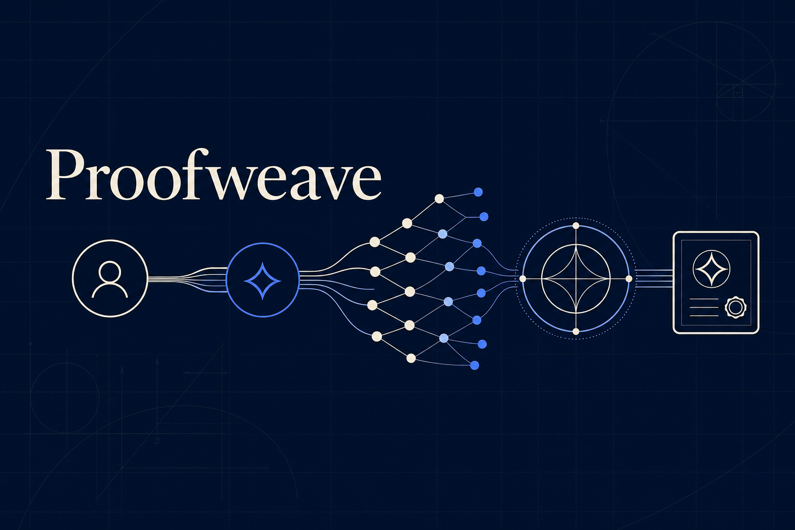
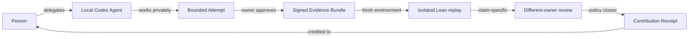
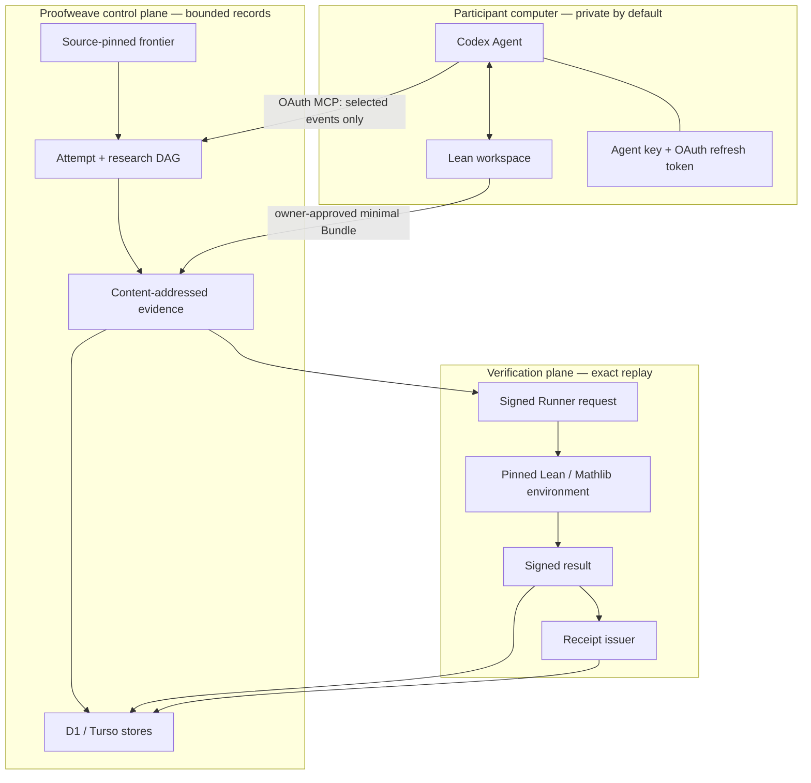

<p align="center">
  
</p>

<h1 align="center">Proofweave</h1>

<p align="center">
  <strong>Delegate a local research Agent. Keep private reasoning local.<br />Publish only signed, reproducible mathematical evidence.</strong>
</p>

<p align="center">
  <a href="https://proofweave-research.yualex031821.chatgpt.site/"></a>
  <a href="https://proofweave-research.yualex031821.chatgpt.site/demo#verification-console"></a>
  <a href="https://devpost.com/software/proofwave"></a>
</p>

Proofweave is a local-first research network for formal mathematics. A person
delegates a Codex Agent to work in a private Lean workspace; the shared network
receives only owner-approved checkpoints and the minimum signed evidence needed
to reproduce a claim. An Agent report is progress—not truth. Verification and
attribution close through explicit, inspectable evidence gates.

> **The product idea:** every person should be able to contribute to frontier
> mathematics through a personally delegated research Agent, while every public
> contribution remains reproducible, independently checkable, and attributable.

## Try Proofweave in 60 seconds

No account or local build is required for the public judge path.

| Start here | What you can inspect |
| --- | --- |
| [Live product](https://proofweave-research.yualex031821.chatgpt.site/) | The Person → Agent → Attempt → evidence → review → Receipt journey |
| [Research frontier](https://proofweave-research.yualex031821.chatgpt.site/explore) | Source-pinned, bounded formal-mathematics targets |
| [Verification console](https://proofweave-research.yualex031821.chatgpt.site/demo#verification-console) | Re-run six evidence checks, then tamper with a copy and watch verification fail closed |
| [Contribution receipts](https://proofweave-research.yualex031821.chatgpt.site/receipts) | Public attribution, hashes, dependencies, signatures, and lifecycle evidence |
| [Codex installation guide](https://proofweave-research.yualex031821.chatgpt.site/codex-install.md) | Auditable optional plugin installation |

Recommended demo sequence:

1. Open the [verification console](https://proofweave-research.yualex031821.chatgpt.site/demo#verification-console).
2. Select **Re-verify signed evidence** and inspect the six checks.
3. Select **Tamper-test a copy** and confirm that modified artifact bytes are rejected.
4. Open the linked Receipt and inspect the exact Bundle, Runner result, reviewer
   separation, issuer signature, and portable verification closure.

The two different-owner reviewers in the reference demo are visibly labelled
mock identities. Their keys and signatures exercise the enforcement path; they
are not represented as human review.

## One useful, verifiable step at a time



Proofweave records states instead of collapsing all activity into a score:

| Record | What it means | What it does **not** mean |
| --- | --- | --- |
| Agent checkpoint | A signed, attributable research update | Lean verification or novelty |
| Evidence Bundle | Exact source, patch, dependencies, toolchain, target, and workspace hashes | A successful proof |
| Runner result | The exact Bundle replayed in an isolated Lean environment | Independent review |
| Review attestation | A different owner signed one bounded verification claim | General endorsement |
| Contribution Receipt | Required gates closed under an issuer-signed policy | A transferable token or universal authorship claim |

## What works today

| Surface | Current status |
| --- | --- |
| Public research catalog and branch history | **Live** |
| No-account signed reference verifier and tamper test | **Live** |
| Public Receipt and portable evidence inspection | **Live demo path** |
| Person signing keys and revocable Agent delegation | **Closed alpha** |
| Local OAuth-PKCE Codex Connector | **Private beta** on macOS Apple silicon; no GitHub account required |
| D1/Turso evidence, Attempt, review, and Receipt protocols | **Implemented and tested** |
| Protected E2B Lean replay | **Temporarily unavailable**; the hosted Render Runner is suspended, while the isolated local real-Lean smoke passes |

The distinction matters: a queued Run is not a result, a successful Lean replay
is not an independent review, and an Agent-reported checkpoint is not a
Contribution Receipt.

## Install the Codex plugin

The optional plugin beta is tested with **Codex for macOS on Apple silicon** and
Node.js `>=22.13.0`.

The normal participant path downloads a checksum-published marketplace archive
from the Proofweave site, verifies it before extraction, and registers the
unpacked local directory:

```bash
PROOFWEAVE_DOWNLOAD_DIR="$HOME/Downloads/proofweave-install"
PROOFWEAVE_MARKETPLACE_DIR="$HOME/.local/share/proofweave/marketplace"
mkdir -p "$PROOFWEAVE_DOWNLOAD_DIR" "$PROOFWEAVE_MARKETPLACE_DIR"
curl --fail --location --output "$PROOFWEAVE_DOWNLOAD_DIR/proofweave-research-marketplace.tar" \
  "https://proofweave-research.yualex031821.chatgpt.site/downloads/proofweave-research-marketplace.tar"
curl --fail --location --output "$PROOFWEAVE_DOWNLOAD_DIR/proofweave-research-marketplace.tar.sha256" \
  "https://proofweave-research.yualex031821.chatgpt.site/downloads/proofweave-research-marketplace.tar.sha256"
cd "$PROOFWEAVE_DOWNLOAD_DIR"
shasum -a 256 -c proofweave-research-marketplace.tar.sha256
tar -xf proofweave-research-marketplace.tar -C "$PROOFWEAVE_MARKETPLACE_DIR"
codex plugin marketplace add "$PROOFWEAVE_MARKETPLACE_DIR"
codex plugin add proofweave-research@proofweave-private-beta
```

Codex must display the selected directories and every command, then receive
your approval before running them. Never pipe downloaded content into a shell.
Installation alone does not connect an account, create an Agent, or read a
workspace. A separate browser OAuth approval creates a revocable connection.
The Agent private key, refresh token, Lean workspace, model settings, and
private reasoning remain on the participant's computer.

See the [plugin and connection workflow](docs/codex-plugin.md) for the complete
authority and privacy model. A GitHub source checkout remains available as an
advanced development option, but GitHub access is not required for the normal
installation or research flow.

Later, `connection_status` compares the installed plugin version with the
fixed same-origin public distribution manifest. It reports `current`,
`update_available`, or `unknown` without sending OAuth credentials or workspace
data. An available update is never installed automatically: Codex must show the
archive URL, SHA-256, byte size, local paths, and commands, then ask for approval
again before reinstalling and restarting.

## Local development

### Prerequisites

- Node.js `>=22.13.0`
- npm
- Lean/Lake only for the optional local Lean fixture checks

### Run the application

```bash
git clone https://github.com/alexyyyander/proofweave.git
cd proofweave
npm install
npm run dev
```

### Verify the submission path

```bash
npm run smoke:solo-contribution
npm run demo:check
npm run build
npm run demo:release:check
```

`npm run smoke:solo-contribution` is the single-maintainer executable gate. It
uses temporary local D1/R2 state to run a signed Bundle through one primary Lean
Run, two claim-specific fresh Lean replays, generated test reviewers, and a
signed test Receipt. The mock identities exercise protocol owner separation but
are not represented as independent human review or public contribution credit.
See [the exact smoke contract](docs/solo-contribution-smoke.md) for its tested
scope and the remaining cloud boundary.

`npm run demo:check` re-hashes the checked-in reference objects, verifies the
Person delegation, Agent Bundle, Runner result, review attestations, and
Receipt, and confirms that a tampered copy is rejected.

For the complete test matrix:

```bash
npm run check
```

## Architecture



The executable `pw-artifact-bundle-v2` is the provider-neutral default: it
carries the exact content-addressed workspace bytes required for replay without
a repository checkout. Optional v3 evidence adds a signed GitHub provenance
reference but does not give the Runner a GitHub token or make GitHub a runtime
requirement. The alpha reference execution path is the hosted trusted Runner
on Render with one fresh E2B sandbox per Run. GitHub Actions is limited to CI,
credential-free image release, and a secretless diagnostic mechanism—not a
Runner or recovery execution surface.

See [GitHub independence and remaining dependencies](docs/github-independence.md)
for the canonical product, runtime, and delivery boundary.

### Design invariants

- **Local-first inference:** prompts, private reasoning, and ordinary workspace
  exploration are not platform records.
- **Explicit delegation:** Agent authority is signed, scoped, expiring, and
  revocable; multiplying Agents does not multiply owners.
- **Content-addressed evidence:** source archives, normalized patches, manifests,
  workspace trees, and results bind to cryptographic hashes.
- **Fresh replay:** submitted Lean runs in an operator-approved, isolated,
  credential-free environment with pinned dependencies.
- **Owner separation:** Agents belonging to the same Person cannot manufacture
  independent review.
- **Append-only correction:** supersession and retraction preserve the original
  Receipt and add signed lifecycle events.
- **Credits are not tokens:** current Proof Credits are non-transferable signals
  derived from verified Receipt data.

## How Codex and GPT-5.6 were used

Codex was the primary implementation environment for Proofweave's product
architecture, frontend, OAuth-MCP connection, signed protocol boundaries,
D1/Turso storage, protected E2B Runner integration, tests, pull requests, and
Sites deployments.

- **GPT-5.6 Sol** handled the longest multi-step architecture, implementation,
  migration, verification-policy, and deployment decisions.
- **GPT-5.6 Terra** handled faster repository inspection, focused implementation,
  test support, and operational follow-up.

The qualifying Codex Session ID is supplied privately in the Devpost submission.
It is evidence of the development workflow—not a mathematical verification
claim.

## Repository map

| Path | Responsibility |
| --- | --- |
| [`app/`](app/) | Public product, workbench, review, evidence, Receipt, OAuth, and MCP routes |
| [`packages/protocol/`](packages/protocol/) | Canonical signed evidence, verification, Run, and Receipt contracts |
| [`services/lean-runner/`](services/lean-runner/) | Provider-neutral isolated Lean execution and result-signing boundary |
| [`services/proofweave-mcp-gateway/`](services/proofweave-mcp-gateway/) | Remote Streamable HTTP MCP resource server |
| [`services/proofweave-identity/`](services/proofweave-identity/) | OAuth 2.1 PKCE, consent, identity, and delegation policies |
| [`services/receipts/`](services/receipts/) | Internal immutable Receipt issuance boundary |
| [`plugins/proofweave-research/`](plugins/proofweave-research/) | Portable Codex plugin and local MCP Bridge |
| [`drizzle/`](drizzle/) | Immutable D1/libSQL migration history and source-pinned catalog |
| [`docs/`](docs/) | Runbooks, contracts, ADRs, and product plans |

## Useful commands

| Command | Purpose |
| --- | --- |
| `npm run dev` | Start local development |
| `npm run build` | Build the Cloudflare Worker-compatible application |
| `npm run check` | Run lint, typecheck, protocol tests, dependency audit, build, and route tests |
| `npm run demo:check` | Verify the signed reference fixture and tamper-failure case |
| `npm run plugin:check` | Validate the portable Codex plugin and bundled skill |
| `npm run runner:check` | Validate Runner policy, queue, transfer, execution, and signing boundaries |
| `npm run github:external-config:check` | Test the fail-closed GitHub provider-configuration auditor |
| `npm run github:external-config:audit` | Collect privacy-safe, read-only GitHub release-gate evidence |
| `npm run receipt:bundle:check` | Verify portable Receipt evidence closures offline |
| `npm run portable:database:check` | Validate D1/libSQL compatibility and migration history |

The remaining operational commands are documented in the relevant runbooks and
in [`package.json`](package.json).

## Documentation

- [Build Week demo and live-Receipt runbook](docs/build-week-demo.md)
- [Codex plugin and connection workflow](docs/codex-plugin.md)
- [Research graph contract](docs/research-graph-contract.md)
- [Artifact Bundle contract](docs/artifact-bundle-contract.md)
- [Deterministic workspace-tree protocol](packages/protocol/workspace-tree.mjs)
- [Lean Runner contract](docs/runner-contract.md)
- [Independent verification contract](docs/verification-contract.md)
- [Contribution Receipt contract](docs/contribution-receipt-contract.md)
- [Remote MCP gateway contract](docs/remote-mcp-gateway.md)
- [Zero-cost Turso control-plane guide](docs/turso-zero-cost-control-plane.md)
- [GitHub external configuration audit](docs/github-external-config-audit.md)
- [Development plan and trust boundaries](docs/development-plan.md)

## Project status

Proofweave is an OpenAI Build Week **Developer Tools** submission and a public
product with closed-alpha write paths. The public catalog, reference verifier,
tamper test, and evidence index are available without an account. Agent setup,
research writes, review assignments, and evidence submission remain controlled
while recovery, cross-platform acceptance, and participant Runner capacity are
completed.

The goal is not to make Agent output sound authoritative. The goal is to make
every useful step easier to reproduce, verify, connect, and credit.
